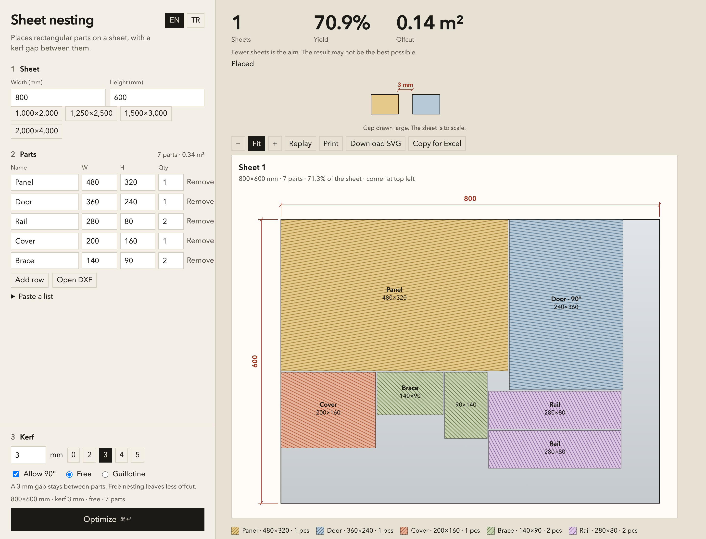

# Sheet nesting

Nest rectangular parts on a sheet. A kerf gap stays between the parts.



Open the app: https://merttoprak1.github.io/sheet-nesting/

You can also open `index.html` in a browser. No install.

The page opens in English. **TR** switches to Turkish.

## Place parts

1. Enter the sheet width and height, in millimetres.
2. Enter each part, or choose **Open DXF**. Paste a list if you already have the sizes.
3. Set the kerf. `0` places the parts flush.
4. Choose **Optimize**.

**Free** leaves less offcut. **Guillotine** keeps cuts that run through the sheet. Turn off **Allow 90°** when the direction is fixed.

The drawing shows the sheet, the yield, the offcut, and the cut list. X and Y start at the top-left corner. **Copy for Excel** copies the list. **Download SVG** saves the layout in millimetres.

The app aims for fewer sheets. The layout can miss a better arrangement.

## DXF

**Open DXF** reads closed rectangles and turns them into parts. Curves, text, hatches, and open lines stay out. Save a binary DXF as ASCII. The app converts the file unit to millimetres.

## Files

`index.html` opens the app. `packer.js` places the parts. `dxf.js` reads the DXF. `app.js` draws the sheet.

Run the tests with:

```
node --test packer.test.js dxf.test.js
```
